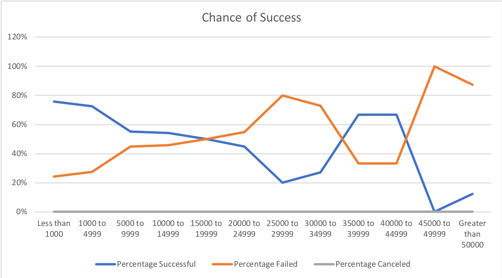

# An Analysis of Kickstarter Campaigns
Performing analysis on Kickstarter data to uncover trends for a potential theater kickstarter campaign

### Challenge

*Keep your fundraising goals low. The higher the goal, your chances of success also fall. I would recommend keeping the kickstarter goal under 15 thousand dollars.
*Begin your kickstarter campaign in May, June, or July. May has the highest chance of success with theater campaigns. We are dealing with just the numbers here as well. It should also be noted that more play projects are started during these months so of course the play funraisers being launched. If we did a percentage for this data compared to just the numbers we could draw more conclusions. 
*Theater projects are by far one of the most successful kickstarter campaigns. It would be highley recommended to fundraise for a play in the theater category.
*One limitation to our data is that the chance of success based on goals and launch date are not regions specific, some regions may do better than others. An anaylsis based on kickstarter success by region would be beneficial.
*We don't have enough data for campaigns that have goals above 25 thousand dollars to be able to pull meaningful data from. Almost 95% of the kickstarter plays have goals that are less than 25 thousand dollars.
