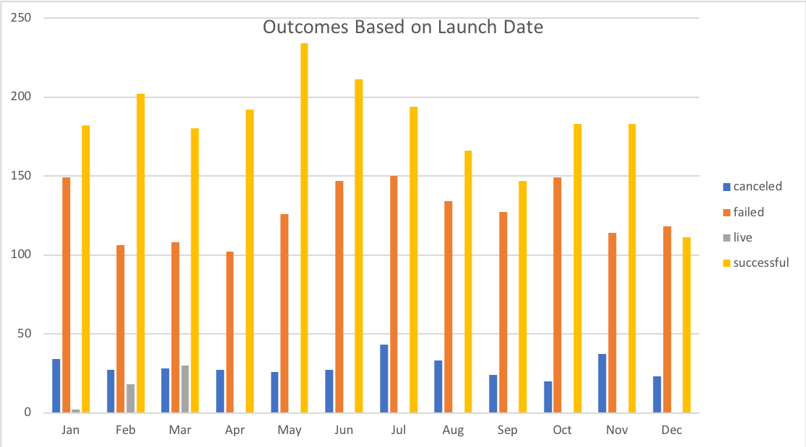
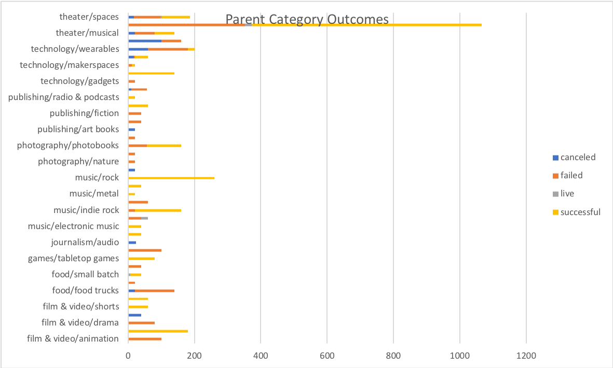
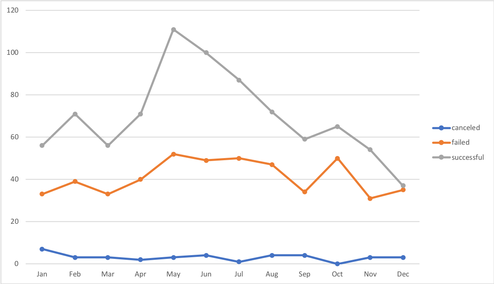
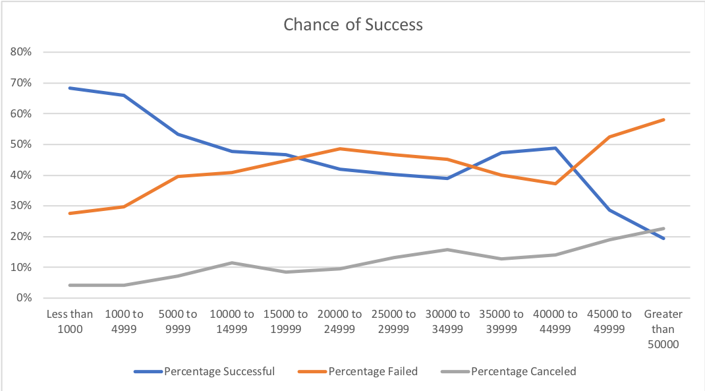

# An Analysis of Kickstarter Campaigns
Performing analysis on Kickstarter data to uncover trends for a potential theater kickstarter campaign

### Challenge

*Keep your fundraising goals low. The higher the goal, your chances of success also fall. I would recommend keeping the kickstarter goal under 15 thousand dollars.
*Begin your kickstarter campaign in May, June, or July. May has the highest chance of success with theater campaigns. 
*Plays are b far one of the most successful kickstarter campaigns. It would be highley recommended to fundraise for a play in the theater category.
*One limitation to our data is that the chance of success based on goals and launch date are not regions specific, some regions may do better than others. An anaylsis based on kickstarter success by region would be beneficial.
*The type of incentives for investors was not calculated that could also play a role in the outcomes.
